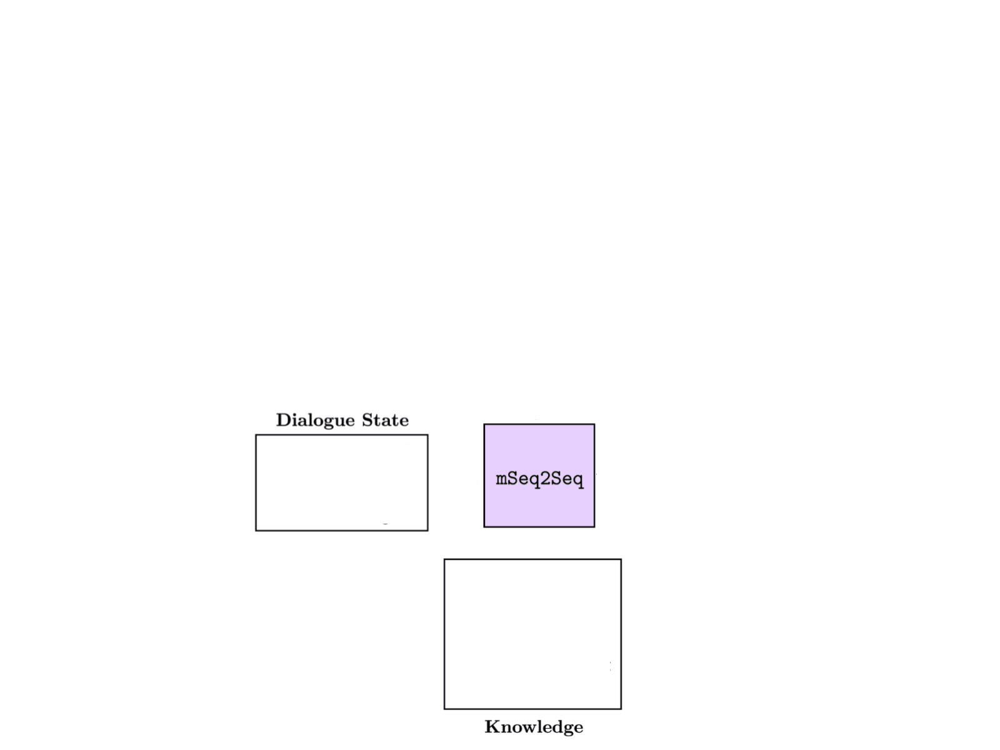

# BiToD: A Bilingual Multi-Domain Dataset For Task-Oriented Dialogue Modeling

This repository includes the dataset and baselines of the paper:

**BiToD: A Bilingual Multi-Domain Dataset For Task-Oriented Dialogue Modeling** [[PDF]](https://arxiv.org/pdf/2106.02787.pdf). 
**Authors**: Zhaojiang Lin, Andrea Madotto, Genta Indra Winata, Peng Xu, Feijun Jiang, Yuxiang Hu, Chen Shi, Pascale Fung

## Citation:
The bibtex is listed below:
<pre>
@article{lin2021bitod,
  title={BiToD: A Bilingual Multi-Domain Dataset For Task-Oriented Dialogue Modeling},
  author={Lin, Zhaojiang and Madotto, Andrea and Winata, Genta Indra and Xu, Peng and Jiang, Feijun and Hu, Yuxiang and Shi, Chen and Fung, Pascale},
  journal={arXiv preprint arXiv:2106.02787},
  year={2021}
}
</pre>

## Abstract:
Task-oriented dialogue (ToD) benchmarks provide an important avenue to measure progress and develop better conversational agents. However, existing datasets for end-to-end ToD modelling are limited to a single language, hindering the development of robust end-to-end ToD systems for multilingual countries and regions. Here we introduce BiToD, the first bilingual multi-domain dataset for end-to-end task-oriented dialogue modeling. BiToD contains over 7k multi-domain dialogues (144k utterances) with a large and realistic parallel knowledge base. It serves as an effective benchmark for evaluating bilingual ToD systems and cross-lingual transfer learning approaches. We provide state-of-the-art baselines under three evaluation settings (monolingual, bilingual and cross-lingual). The analysis of our baselines in different settings highlights 1) the effectiveness of training a bilingual ToD system comparing to two independent monolingual ToD systems, and 2) the potential of leveraging a bilingual knowledge base and cross-lingual transfer learning to improve the system performance in the low resource condition.


## Leaderboard

**Monolingual**
|                |       English (EN)      |       |                      |       |       |       Chinese (ZH)      |       |                      |       |       |
|----------------:|:-----------------------:|:-----:|:--------------------:|:-----:|:-----:|:-----------------------:|-------|----------------------|-------|-------|
|                |           **TSR**           |  **DSR**  | **API_ACC**              |  **BLEU** |  **JGA**  |           **TSR**           |  **DSR**  | **API_ACC**              |  **BLEU** |  **JGA**  |
|          mBART |            56           | 33.71 |         57.03        | 35.34 | 67.36 |          56.82          | 29.35 |         71.89        | 20.06 | 72.18 |
|            mT5 |          69.13          | 47.51 |         67.92        | 38.48 | 69.19 |          53.77          | 31.09 |         63.25        | 19.03 | 67.35 


**Bi-lingual** 
|                |       English (EN)      |       |                      |       |       |       Chinese (ZH)      |       |                      |       |       |
|----------------:|:-----------------------:|:-----:|:--------------------:|:-----:|:-----:|:-----------------------:|-------|----------------------|-------|-------|
|                |           **TSR**           |  **DSR**  | **API_ACC**              |  **BLEU** |  **JGA**  |           **TSR**           |  **DSR**  | **API_ACC**              |  **BLEU** |  **JGA**  |
|          mBART |          42.45          | 17.87 |         65.35        | 28.76 | 69.37 |          40.39          | 16.96 |         65.37        |  5.23 |  69.5 |
|            mT5 |          71.18          | 51.13 |         71.87        | 40.71 | 72.16 |          57.24          | 34.78 |         65.54        | 22.45 |  68.7


**Cross-lingual**
|                |  ZH&#8594;EN (10\%)     |       |                      |       |       | EN&#8594;ZH (10\%)      |       |                      |       |       |
|----------------:|:-----------------------:|:-----:|:--------------------:|:-----:|:-----:|:-----------------------:|-------|----------------------|-------|-------|
|                |           **TSR**           |  **DSR**  | **API_ACC**              |  **BLEU** |  **JGA**  |           **TSR**           |  **DSR**  | **API_ACC**              |  **BLEU** |  **JGA**  |
|          mBART |           1.11          |  0.23 |          0.6         |  3.17 |  4.64 |            0            |   0   |           0          |  0.01 |  2.14 |
|           +CPT |          36.19          | 16.06 |         41.51        |  22.5 | 42.84 |          24.64          | 11.96 |         29.04        |  8.29 | 28.57 |
|           +MLT |          33.62          | 11.99 |         41.08        | 20.01 | 55.39 |          44.71          | 21.96 |         54.87        | 14.19 | 60.71 |
|            mT5 |           6.78          |  1.36 |         17.75        | 10.35 | 19.86 |           4.16          |  2.2  |         6.67         |  3.3  | 12.63 |
|           +CPT |          44.94          | 24.66 |         47.6         | 29.53 | 48.77 |          43.27          |  23.7 |         49.7         | 13.89 |  51.4 |
|           +MLT |          56.78          | 33.71 |         56.78        | 32.43 | 58.31 |           49.2          | 27.17 |         50.55        | 14.44 | 55.05 

## Dataset
Training, validation and test data are avalible in `data` folder. We also provide the data split for cross-lingual few shot setting.
```
{
    dialogue_id:{
        "Scenario": {
            "WizardCapabilities": [
            ],
            "User_Goal": {
            }
        }
        "Events":{
            {
                "Agent": "User",
                "Actions": [
                    {
                        "act": "inform_intent",
                        "slot": "intent",
                        "relation": "equal_to",
                        "value": [
                        "restaurants_en_US_search"
                        ]
                    }
                ],
                "active_intent": "restaurants_en_US_search",
                "state": {
                "restaurants_en_US_search": {}
                },
                "Text": "Hi, I'd like to find a restaurant to eat",
            },
            {
                "Agent": "Wizard",
                "Actions": [
                    {
                        "act": "request",
                        "slot": "price_level",
                        "relation": "",
                        "value": []
                    }
                ],
                "Text": "Hi there. Would you like a cheap or expensive restaurant?",
                "PrimaryItem": null,
                "SecondaryItem": null,
            },
            ...
        }
    }
}
```

## Experimental Setup
### Dependency
Check the packages needed or simply run the command
```console
❱❱❱ pip install -r requirements.txt
```

### Setup MongoDB server
Install MongoDB server. Please check the documentation in this [link](https://docs.mongodb.com/manual/administration/install-community/).

Then, export the DB dump by running the following command
```console
❱❱❱ cd ./db && bash restore.sh
```

### Preprocessing
```console
❱❱❱ python preprocess.py --setting zh
```
* --setting: data preprocessing for monolingual, bilingual, and crosslingual setting. Options: [en, zh, en_zh, en2zh, zh2en]

## Baselines
Here we show one example for training and evaluation. Check `run.sh` to run all the baselines




### mT5(zh)
**Train**
```
CUDA_VISIBLE_DEVICES=0,1 python -m torch.distributed.launch --nproc_per_node=2 train.py \
--model_name_or_path google/mt5-small \
--do_train \
--do_eval \
--train_file data/preprocessed/zh_train.json \
--validation_file data/preprocessed/zh_valid.json \
--learning_rate 5e-4  \
--num_train_epochs 8 \
--source_lang en_XX \
--target_lang en_XX \
--logging_steps 100 \
--save_steps 2000 \
--output_dir save/zh_mt5_5e-4 \
--per_device_train_batch_size=8 \
--per_device_eval_batch_size=8 \
--gradient_accumulation_steps 8 \
--overwrite_output_dir \
--predict_with_generate \
--fp16 \
--sharded_ddp zero_dp_3
```

* --model_name_or_path: path of pre-trained models
* --train_file: preprocessed training file
* --output_dir: output_dir

**Evaluate Model**
```console
❱❱❱ CUDA_VISIBLE_DEVICES=0 python evaluate.py --model_path save/zh_mt5_5e-4 --setting zh --reference_file_path data/zh_test.json --save_prefix t5_
```

* --model_path: path of the trained model
* --reference_file_path: test set data path
* --save_prefix: prefix of result file

**Evaluate File**
We also support evalute the prediction file:
```console
❱❱❱ python evaluate.py --eval_mode eval_file --prediction_file_path result/zh_end2end_predictions.json --setting zh --reference_file_path data/zh_test.json
```

